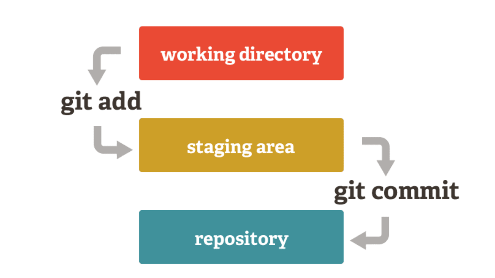

# What is Git?
* Git is version control system means it saves the history of files that any changes you made.

[Download Git](https://git-scm.com/download/win)
* Install Git

### To check your Git Version :
    git --version

### To set your configuration of your account :
    git config --global user.name "Your Name"
    git config --global user.email "yourmail@gmail.com"

### To check your account information :
    git config --global user.name
    git config --global user.email

### To change your information :
    git config --global --edit

### To exit from editor in git :
* `Esc` + `:` + `wq`

### To create a new folder :
    mkdir FolderName

### To change the directory :
    cd FolderName

### To initialize a folder as git repository :
    git init

### To check the content of a folder :
    ls

### To check hidden content of a folder :
    ls -a

### To check the status like what changes are made or modification are done :
    git status

### To go in Staging Area : 
* It basically hold the changes before you commit.

        git add file.name

### To commit from staging area :
    git commit -m "your message"

### To check how many have commit are :
    git log

### To clear the terminal :
* `Ctrl` + `l`

### To go on particular commit :
    git checkout HashID
* Here, with HashID created different branch

### To back on present from that particular commit :
    git checkout master

### To check how many branch :
    git branch

### To create new branch :
    git branch branchName

### To create new branch and point hea to that branch :
    git checkout -b branchName

* **Example- branchName** anuj/multiply

### To merge a branch to other branch :
    git merge anuj/multiply
#### Note : 
* Your head must point to another branch in which you want to merge.

### To ignore the files in git/github :
    touch .gitignore
* put the files name inside the `.gitignore` for ignore that file.

### To add local repository to github :
    git remote add origin url

### To push all content of local repository to github :
    git push -u origin branchName

### To push other branch :
* First our hea should point on that branch

        git push -u origin branchName

### To add collaborator to your existing repository :
* Go `setting` -> `manage access` -> `add collaborator`
* Here collaborator can access your repository edit modify the changes.

### To fork a repository :
* Fork a existing repository.
* Clone that repository on local.
* Make changes on them.
* Pull Request.
* Repeat.